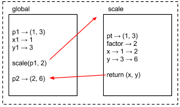

# Tuples

## Reference
- [Python Tuples](http://www.tutorialspoint.com/python/python_tuples.htm)

## Tuples
- A **tuple** is a collection of data enclosed in parentheses
    - **Tuple packing** is the assignment of data to a tuple variable
    - **Tuple unpacking** is the extraction of data from a tuple.
- **Tuple indexes** are determined by their order in the tuple, and begin with zero
    - Access and individual element from a tuple using the **index operator []** 
```python
# tuple basics
p1 = (1, 3)             # packing
x1, y1 = p1             # unpacking
print(x1, y1)           # prints '1 3'
print(p1[0], p1[1])     # indexing - prints '1 3
```


## Tuples in Functions

- Tuples can allow you to return multiple data values from a function
```python
# tuples and functions
def scale(pt, factor):
    x, y = pt
    x *= factor      # same as x = x * factor
    y *= factor
    return (x, y)

def main():
    p1 = (1, 3)
    p2 = scale(p1, 2)
    print(p2)       # (2, 6)


main()
```
