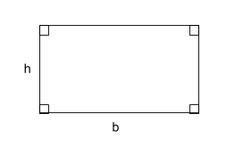
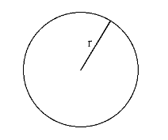
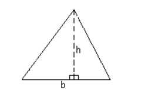
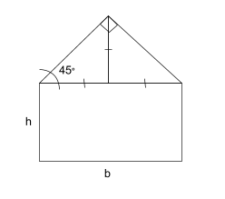
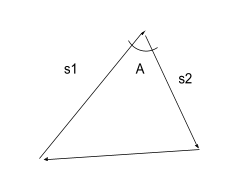

# P1 Polygons

## Getting Started

- implement the specified functions in the provided started code

## Areas

- **rect_area(b, h)**
    - parameters
        - b : base width of rectangle
        - h : base height of rectangle
    - return
        - area of rectangle
    - 

- **circle_area(r)**
    - formula
    - parameters
        - r : radius of circle
    - return
        - area of circle
    - 

- **triangle_area(b, h)**
    - formula
    - parameters
        - b : base width of triangle
        - h : height of triangle (perpendicular to base)
    - return
        - area of triangle
    - 

- **house_area(b, h)**
    - parameters
        - b : base length of house
        - h : height of house to roof line (bottom of roof)
    - return
        - area of house
    - 
    - note
        - you should use your other function inside of this function
        - you can assume that the roof is formed by two adjacent isosceles triangles. In other words, each triangle's base and height are each one half the base length of the house.
    
## Drawing

- **draw_rect(t, b, h)**
    - parameters 
        - t : use this variable as the turtle to draw with
        - b, h : width and height

- **draw_circle(t, r)**
    - parameters
        - t : use this turtle to draw
        - r : radius of circle

- **draw_triangle(t, s1, a, s2)**
    - parameters
        - t : use this turtle to draw
        - s1 : draw this side first
        - a : turn this many degrees
        - s2 : draw this side second
    - 

- **draw_house(t, b, h)**
    - parameters
        - t : use this turtle to draw
        - b, h : width and height
