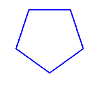
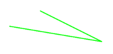
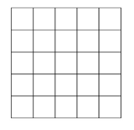
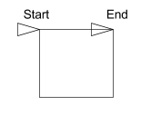
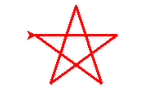
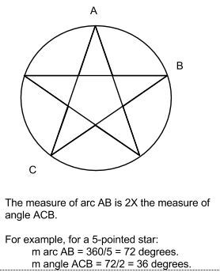
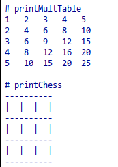
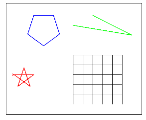

# P1 Loops

## Directions

- Use the provided template code as your starting point
- implement the functions where you see **pass**

## Problems

### **print_mult_table(n)**

- print an *n x n* multiplication table, starting at 1 and ending at *n*
- parameter
    - n : dimensions of the multiplication table
- example, where n == 5

    

- Hint: review notes on Nested Loops

### **print_chess(rows, columns)**

- print a chess board using the dash "*-*" and pipe "|" characters
- parameters
    - rows : number of rows 
    - columns: number of columns
- example, where rows == 3 and columns == 3

    

### **draw_poly(t, n, s)**

- draws a regular *n*-sided polygon with side length *s*
- parameters
    - t : turtle object used to draw the polygon
    - n : number of sides 
    - s : length od each side
- example, where n == 5

    

- Hints
    - sum of interior angles = (n-2) * 180
    - all of the interior angles of a regular polygon are congruent (same measure)

### **draw_coords(t, points)**

- draws the coordinates given as (x, y) tuples from the points list
- parameters
    - t : turtle object used to draw the coordinates
    - points : list of (x, y) tuples
- example. where coordinates are (100, 200) , (300, 100) and (0, 150)

    

### **draw_chess(t, rows, cols, s)**

- draws a chess board of size *rows* x *cols* with cell size *s*
- parameters
    - t : turtle object used to draw chess board
    - rows : number of rows
    - cols : number of columns
    - s : side length of each cell
- example, where rows == 5 and cols == 5

    

- Hints
    - start by drawing a square of side length *s* (see drawing)

        
    - use a loop to repeat
    - when you get to the end of a row, bring the turtle back to the start of the next row

### draw_star(t, n ,w)**

- draws a start with *n* points and of width *w*
    - base : draws odd stars with 5+ points (5, 7, 8, etc)
    - **CHALLENGE 1**: draws odd and even start with 5+ points
    - **CHALLENGE 2**: write another function to draw a star using the p,q parameter method described [here](https://en.wikipedia.org/wiki/Star_polygon)
- parameters
    - t : turtle object used to draw the star
    - n : number of points
    - w : length of a diagonal
- example, where n == 5

    

- Hint

    

### Sample output

