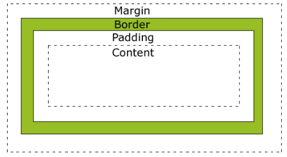
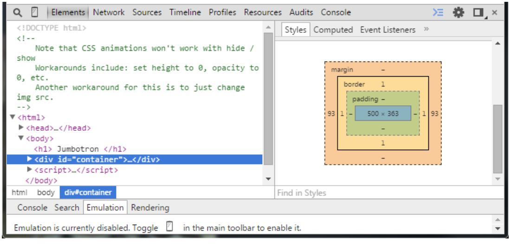

# Cascading Style Sheets (CSS)

## References

- [W3Schools CSS Tutorial](http://www.w3schools.com/css/default.asp)
- [W3Schools CSS Reference](http://www.w3schools.com/sitemap/sitemap_references.asp)

## Essentials

- **Cascading Style Sheets (CSS)** are used to style your webpage
	- They can also add some additional functionality to your page
- CSS can be inserted 3 ways
	- **external** CSS in a separate ```.css``` file
	- **internal** CSS in a ```<style>``` tag in the ```<head>```
	- **inline** CSS using a 'style' attribute
- Cascading refers to the fact that styles can override others
	- internal style will override external styles
	- inline styles will override internal and external styles
 -  Example:
 
 ```html
 
 <!DOCTYPE html>
<html>
	<head>
		<title>Template Page</title>
		<!-- optional: external stylesheet 
			will show error if file doesn't exist -->
		<link rel="stylesheet" type="text/css" href="mystyle.css">
		<style>
			/* comment: internal CSS goes here */
			body { 
				background-color: lightblue; 
			}
		</style>
	</head>
	<body>
		<!-- inline CSS uses the 'style' attribute -->
		<h1 style='text-align:center;'> CSS Template </h1>
		<p> Hello CSS! </p>
	</body>
</html>
```

## Selectors and Pseudos

- You can select elements by id, className, or tagName
	- use tagName to apple the style to all elements of that type
	- use id to style a single element uniquely
	- use className to style a group of elements the same way
- Selectors
	- The pound (#) is the id selector
	- The dot (.) is the className selector
	- You can combine selectors
- Pseudo-classes
	- Special conditions are identified using pseudo-classes
	- The colon (:) is teh pseudo-class selector
	
```html

<html>
	<head>
	<style>
	
		p {
			/* apply these styles to all p elements */
		}
		
		p, h1{
			/* apply these styles to all p AND h1 elements
		}
  
		#no1 {
			/* apply these styles to THE element with id=no1 */
		}
		
		p.type1 {
			/* apply these styles to ALL p elements with class=type1 */
			/* omit the p to apply a class to different element types */
		}
		
		#div2 p {
			/* apply these styles to all p elements INSIDE of element with id=div2 */
		}

		p:hover {
			/* apply these styles to the p with the mouse pointer over it */
		}
	</style>

	<body>

		<h1> Heading </h1>

		<div id='div1'>
			<p id='no1' class='type1'> paragraph 1 </p>
			<p> paragraph 2 </p>
			<p class='type1'> paragraph 3 </p>
			<p> paragraph 4 </p>
			<p class='type1'> paragraph 5 </p>
	</div>

	<div id='div2'> 
		<p> The p in div2 </p> 
	</div>

	</body>
</html>
```

## Styling Element

- See [CSS Tutorial](http://www.w3schools.com/css/default.asp)
	-  'Introduction' to 'Tables'
- CSS can be used to
	- set background color, img
	- set text, fonts, and text-alignment
	- style links, lists, and tables
	- and more ...
- CSS Units
	- Fonts sizes should be set using the **em** unit
	- 1em is the default font size (1em = 16px), so 2em would be twice that, etc
	
## Box model and dimensions



- The Css box model allows you to add
	- padding - space between content and border
	- border
	- margin space between border and other elements

- Box model components are typically set using the **px** unit (pixels), but can be set using the **em** also.

- CSS dimensions
	- height / width
	- min-height / min-width
	- max-height / max-width

- Dimensions can be
	- automatically applied = block elements are 100% and inline elements wrap to content
	- fixed width - set using **px**
	- relative width - set using % (percentage of container size)

## Display, positioning, alignment

- CSS displays
	- **none** do not show (takes up no space)
	- **hidden** do not show (still takes up space)
	- **block** line break before / after (takes up full width)
	- **inline** no line breaks
- CSS positioning
	- **static** default - element is in normal flow of the page
	- **fixed** fixed position relative to the browser window
	- **relative** position relative to normal (static) position
	- **absolute** position relative to page (or non-static containing element)
- CSS floating
	- pushes element to the **left** or **right** to allow other elements to wrap around
	- floated elements will go next to each other if there is room, or else they will wrap to the next line
	- use **clear** to stop floating
- Alignment
	- to center-align block elements us ```margin: 0 auto;```

## Inspection

- Recall that you can inspect HTML in Chrome by using the Chrome Dev Tools
	- Right Mouse click -> Inspect Element
- In the panel on the right, you can inspect the CSS


