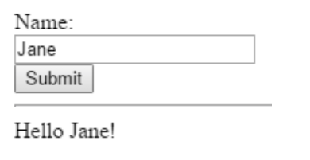
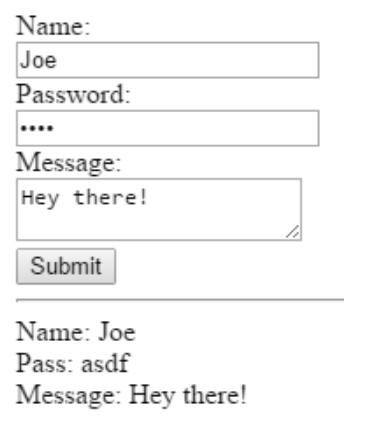
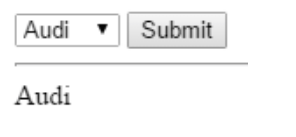

# HTML Forms & Input

## References

- W3Schools Forms
    - [Form Elements](http://www.w3schools.com/html/html_form_elements.asp)
    - [Input Types](http://www.w3schools.com/html/html_form_input_types.asp)
- W3Schools Document Object Model (DOM)
    - [HTML DOM Tutorial](http://www.w3schools.com/js/js_htmldom.asp)
    - [HTML DOM Reference](http://www.w3schools.com/jsref/default.asp)


## HTML Inputs

- Allow you to get input from the user
    - You can enclose inputs in a ```<form>``` element, but it is not required
    - If you use a ```<form>``` element, you should place the submit button outside of the form to prevent the page from reloading

### Simple text input example

- In the HTML
    - Use the **onclick** attribute of the ```<button>``` to specify the function to execute when the button is clicked (the **event handler**)
- In the event handler
    - Use **document.getElementById** to get a JS object representing the HTML element
    - Use the **value** property of a text input to get the data
    - Set the **innerHTML** of a display element to show the results
- Note
    - In Google Chrome, an element id automatically becomes a global JS variable

- Example:

#### HTML

``` html
Name: <br>
<input id='nameinput' type='text'></input> <br>
<button onclick='submit()'> Submit </button>
<hr>
<div id='result'></div>
```

#### JS

``` javascript
function submit(){

    // get references to the elements
    // not required since ids become global variables!
    var nameinput = document.getElementById('nameinput')
    var result = document.getElementById('result')

    var name = nameinput.value
    result.innerHTML = "Hello " + name
}
```

#### Result



## Other text input types

- Passwords
- Text Areas
- You can use **document.getElementsByTagName** to get all of your inputs in an array

#### HTML

``` html
Name: <br>
<input type='text'/> <br>
Password: <br>
<input type='password'/> <br>
Message: <br>
<textarea></textarea> <br>
<button onclick='submit()'> Submit </button>
<hr>
<div> </div>
```

#### JS

``` javascript
function submit(){

    // get elements using tagnames
    var inputs = document.getElementsByTagName('input')
    var textarea = document.getElementsByTagName('textarea')[0]
    var div = document.getElementsByTagName('div')[0]

    // get values
    var name = inputs[0].value
    var pass = inputs[1].value
    var msg = textarea.value

    // update result
    div.innerHTML = "Name: " + name +
        "<br> Pass: " + pass +
        "<br> Message: " + msg
}
```

#### Result



## Select (dropdown) menus

- Use a select menu to provide options for a user to choose

#### HTML

``` html
<select id="cars">
  <option value="Volvo">Volvo</option>
  <option value="Saab">Saab</option>
  <option value="Fiat">Fiat</option>
  <option value="Audi">Audi</option>
</select>
<button onclick='submit()'>Submit</button>
<hr>
<div id='result'></div>
```

#### JS

``` javascript
function submit(){
    result.innerHTML = cars.value
}
```

#### Result



## Checkboxes and Radio buttons

- Elements
    - Radio buttons are functionally similar to selects - you use them to choose a single option
    - Checkboxes are used when you want to select multiple options
- Attributes / Properties
    - Use **name** to group checkboxes and radio buttons
    - Use can use **disabled** to disable elements
    - Use **checked** to check elements by default and to determine which selection(s) in a group the use clicked

#### HTML

``` html
<!-- select one -->
<input type="radio" name="species" value="human" checked> human <br>
<input type="radio" name="species" value="dog"> dog <br>
<input type="radio" name="species" value="bird"> bird <br>
<input type="radio" name="species" value="fish"> fish <br>
<input type="radio" name="species" value="alien" disabled> alien <br>
<br>
<!-- select many -->
<input type="checkbox" name="vehicle" value="bike">bike <br>
<input type="checkbox" name="vehicle" value="car">car <br>
<input type="checkbox" name="vehicle" value="seg">segway <br>
<input type="checkbox" name="vehicle" value="scoot">scooter <br>
<input type="checkbox" name="vehicle" value="plane">airplane <br>
<br>
<button onclick='submit()'>Submit</button>
<hr>
<div id='result'></div>
```

#### JS

``` javascript

function submit(){

    // get species
    var species = document.getElementsByName('species')
    var s;
    for( var i=0; i<species.length; i++ ){
        if(species[i].checked){
            s = species[i].value
            break
        }
    }

    // get all vehicles
    var vehicles=document.getElementsByName('vehicle')
    var v=[]
    for(var i=0; i<vehicles.length; i++){
      if(vehicles[i].checked){
        v.push(vehicles[i].value)
      }
    }

    // the array will be converted to a string
    // same as calling v.toString()
    result.innerHTML = "I am a " + s + " and I have " + v
}
```

#### Result


## CSS selectors

- Additionally, HTML elements can be accessed using CSS selectors
    - **document.querySelector**
    - **document.querySelectorAll**
- Some more advanced CSS selectors are

| Selector | Description |
| --- | --- |
| ```[attribute=value]``` | select elements with matching attribute/value pairs |
| ```:checked``` | select checked input elements |

#### HTML & Result (see above checkboxes and radio buttons)

#### JS

``` javascript
function submit(){
    var species = document.querySelector('[name=species]:checked')
    var s = species.value

    var vehicles = document.querySelectorAll('[name=vehicle]:checked')
    var v = []
    for(var i=0; i<vehicles.length; i++){
        v.push(vehicles[i].value)
    }

    result.innerHTML = "I am a " + s + " and I have " + v
}
```

## Using the form element
- The ```<form>``` element allows you to group inputs
    - A page's form(s) are access using **document.forms**
    - The form elements become properties of the form object by **name**
    - You can also use the ```<output>``` element

#### HTML

``` html
<!-- DO set these values for method and onsubmit -->
<form method='post' onsubmit='return false'>
    <input name='in1'/> <output name='out1'></output> <br/>
    <input name='in2'/> <output name='out2'></output> <br/>
    <input name='in3'/> <output name='out3'></output> <br/>
    <select name='in4'>
        <option value='A'> A </option>
        <option value='B'> B </option>
        <option value='C'> C </option>
    </select> <output name='out4'></output> <br/>
    <input type='submit' onclick='process()'/>
</form>
```

#### JS

``` javascript
// DON'T name the function submit()
function process(){
  var form = document.forms[0]

  form.out1.value = form.in1.value
  form.out2.value = form.in2.value
  form.out3.value = form.in3.value
  form.out4.value = form.in4.value
}
```

#### Result


