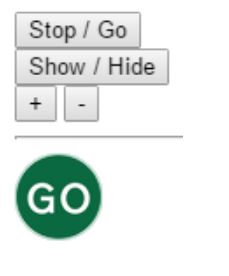
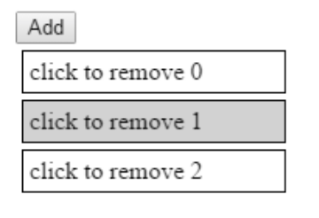

# HTML DOM - Manipulating page content

## Reference

- [W3Schools HTML DOM Tutorial](http://www.w3schools.com/js/js_htmldom.asp)
- [W3Schools HTML DOM Reference](http://www.w3schools.com/jsref/default.asp)

## The DOM

- DOM stands for **Document Object Model**
- The DOM is used to access and modify HTML elements using JavaScript
- The DOM is a tree representation of an HTML document


## DOM Methods

- *See previous motes for examples*
- The *document* object is at the top of the hierarchy
- Getting elements
    - ```document.getElementById```
    - ```document.getElementsByTagName```
    - ```document.getElementsByClassName```
    - ```document.getElementsByName```
- Getting elements using CSS selectors
    - ```document.querySelector```
    - ```document.querySelectorAll```
- Once you have an element, you can use DOM methods to get to its child elements

### Equivalent DOM method calls

| Get | CSS Selector |
| --- | --- |
| ```document.getElementById('i')``` | ```document.querySelector('#i')``` |
| ```document.getElementsByTagName('t')``` | ```document.querySelectorAll('t')``` |
| ```document.getElementsByClassName('c')``` | ```document.querySelectorAll('.c')``` |
| ```document.getElementsByName('n')``` | ```document.querySelectorAll('[name=n]')``` |

## Navigating the DOM

- **Navigting the DOM** is using elements to get to other elements
- You can use DOM properties to navigate
    - ```e.parentNode```
    - ```e.childNodes[i]```
    - ```e.firstChild```
    - ```e.lastChild```
    - ```e.nextSibling```
    - ```e.previousSibling```

## Modifying elements

- Use element.**innerHTML** to change the HTML content of an element
- You can modify element attributes and styles
    - HTML attributes become properties of the DOM object
    - Use the dot operator (```.```) to get or set attribute values
- CSS properties are accessed using the ```style``` property of the DOM object
    - hyphenated CSS properties are changed to camelcase (e.g. ```background-color``` becomes ```backgroundColor```
- Use the CSS display property to **hide** and **show** elements

| CSS property | Action |
| --- | --- |
| ```display:none``` | hide |
| ```display:hidden``` | hide but still take up space |
| ```display:block``` | display as a block element |
| ```display:inline``` | display as inline element |


#### HTML

``` html
<button onclick='toggleSrc()'> Stop / Go </button> <br>
<button onclick='toggleShow()'> Show / Hide </button> <br>
<button onclick='scale(1.1)'> + </button>
<button onclick='scale(0.9)'> - </button><hr>
</img>
```

#### JS

``` javascript
var stop = 'http://bit.ly/1si0NNk'
var go = 'http://bit.ly/1aN8eWc'

function toggleSrc(){
    if( img.src == go )
        img.src = stop
    else
        img.src = go
}

function toggleShow(){
    if( img.style.display == 'none' )
        img.style.display = 'inline-block'
    else
        img.style.display = 'none'
}

function scale(factor){
    img.width *= factor
}

```

#### Result



## Using classes

- By adding and removing classes, you can change CSS properties easily

#### HTML

``` html
<button onclick='toggleClass()'>Toggle styles</button>
<hr>
<div id='mydiv'> Hello World! </div>
```

#### CSS

``` css
.styled{
    font: 1.5em arial;
    padding:0.25em;
    text-align:center;
    background-color:blue;
    color:white;
}
```

#### JS

``` javascript
function toggleClass(){
    console.log( mydiv.classname )

    if( !mydiv.className )
        mydiv.className = 'styled'
    else
        mydiv.className = ''
}

```

#### Result


- Give it a try [here](https://repl.it/HC1T/1)

## Adding and Removing elements

- You can use the DOM to create, add, and remove elements
    - ```document.createElement('tagname')```
    - ```parent.appendChild(newNode)```
    - ```parent.insertBefore(newNode, beforeThis)```
    - ```parent.removeChild(childNode)```
    - ```element.remove()```
- Try it out [here](https://repl.it/HC1z/1)

#### HTML

``` html
<button onclick='add()'>Add</button>
```

#### CSS

``` css

div{
    width:10em;
    border:1px solid black;
    padding:0.25em;
    margin:0.25em;
}

div:hover{
    background-color:lightgrey;
}
```

#### JS

``` javascript

var cnt = 0

function add(){

// create element
    var el = document.createElement('div')
    el.innerHTML = 'click to remove ' + cnt++
    el.onclick = rem

    // add to body
    document.body.appendChild( el )
}

// handler with event object (see also: event handling notes)
function rem(event){

    // target is the element that was clicked
    target = event.target

    // remove element
    target.remove()
}
```

#### Result


